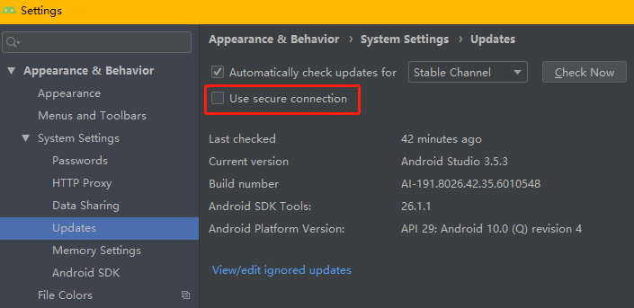

AS 3.5.3 Plugins 不能显示插件，不能搜索插件
=====

C:\Users\用户名\\\.AndroidStudioX.Y\config\plugins 其中的X或Y对应当前版本3.3，3.4，3.5
将C:\Users\用户名\\\.AndroidStudioX.Y\config\plugins\availables.xml文件拷贝，
替换掉~\AndroidStudio3.5\config\plugins目录下的availables.xml文件

注意：如果没有以前的版本的文件，可到res\Q1目录下下载该文件[availables.xml](res/Q1/availables.xml)
